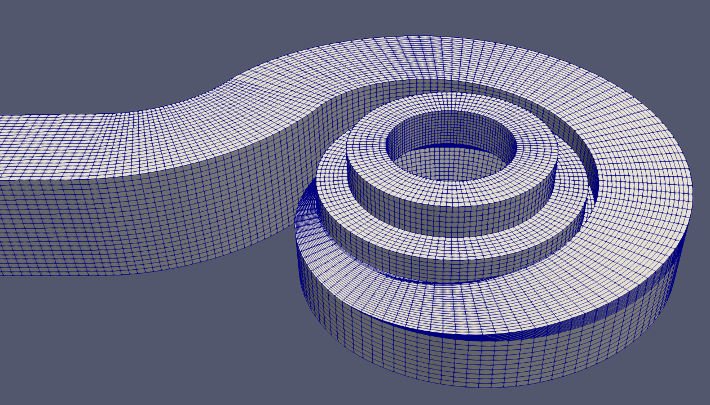

# `classy_block` examples
Example project, cases and tests for `classy_blocks`.

## Usage
1. Prerequisites
    1. OpenFOAM (just about any version)
    2. Prepare python virtual environment:
        $ python -m venv venv
        $ "venv/bin/activate"
        $ python -m pip install -U pip
        $ python -m pip install -r requirements_dev.txt
        $ python -m pip install -e .
2. Run `examples/run.py`
3. Open `examples/case/case.foam` with ParaView to inspect the mesh.

## Showcase
These are some screenshots of parametric models, built with classy_blocks.

Rectangular ducts (Extrude and Revolve Operations)

3D pipes with twists and turns (Elbow and Cylinder Shapes)

A simple tank with rounded edges

A flywheel in a case. VTK Blocking output for debug is shown in the middle

Venturi tube

Coriolis flowmeter with meshed fluid (blue) and solid section (white), ready for an FSI simulation.

2D mesh for studying Karman Vortex Street

Helmholtz nozzle, a resonator with sharp edges. See [this sketch](https://www.researchgate.net/figure/Schematic-diagram-of-a-Helmholtz-oscillator-and-its-operating-principles_fig6_305275686).

A real-life square volute with a blunt cutwater

Edges and faces, projected to an STL surface

Mesh for studying flow around a sphere, with projected edges and faces

A parametric, Low-Re mesh of a real-life impeller *(not included in examples)*

