# classy_blocks

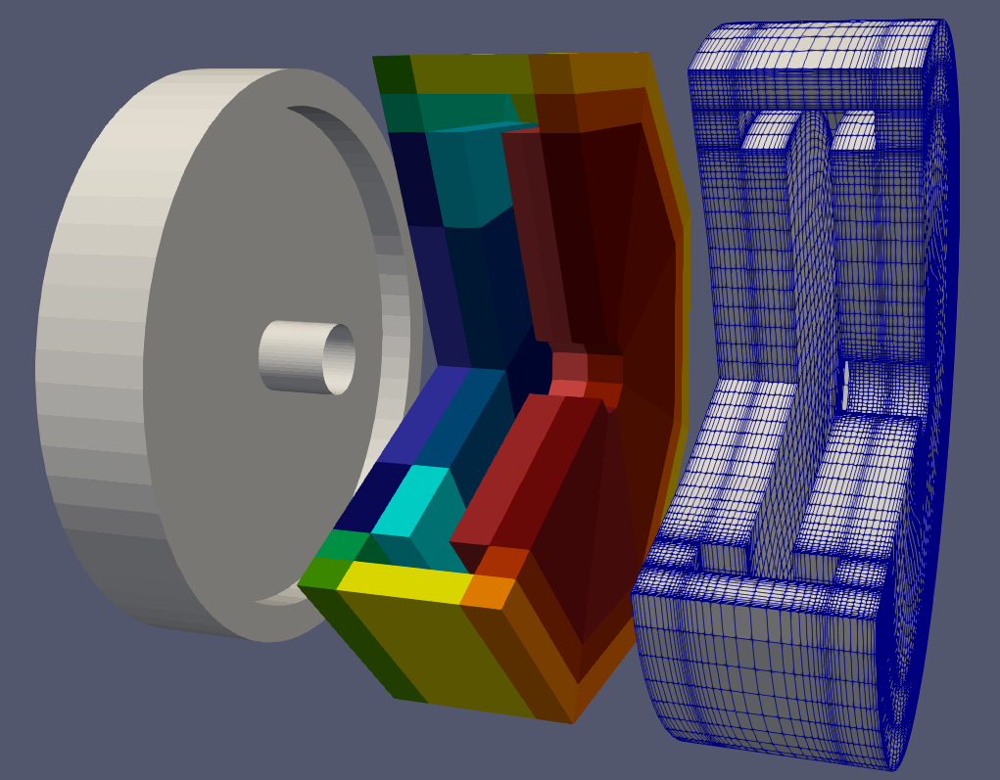

Python classes for easier creation of OpenFOAM's blockMesh dictionaries.

> Warning! This project is currently under development and is not yet very user-friendly. It still lacks some important features and probably features a lot of bugs. However, you're welcome to suggest features, improvements, and point out bugs.

> Note: version 1.0.0 introduced backwards-incompatible changes in API. Use [latest 0.0.1 commit](https://github.com/damogranlabs/classy_blocks/tree/30d12834194313c6243a921267aabf3233454280) for your old scripts. However, you might want to give the new version a try...

# About
_blockMesh_ is a very powerful mesher but the amount of manual labour it requires to make even the simplest
meshes makes it mostly useless. Even attempts to simplify or parametrize blockMeshDicts with `#calc` or even
the dreadful `m4` quickly become unmanageable and cryptic.

classy_blocks' aim is to minimize the amount of meticulous work by providing a
more intuitive workflow, off-the-shelf parts and some automatic helpers for building and optimization of block-structured hexahedral meshes.
Still it is not an automatic mesher and therefore some kinds of geometry are more suited than others.

## Tutorial
Check out the [classy_blocks tutorial on damogranlabs.com](https://damogranlabs.com/2023/04/classy_blocks-tutorial-part-1-the-basics/)!

## Useful For
### Fields
- Turbomachinery (impellers, propellers)
- Microfluidics
- Flow around buildings
- Heat transfer (PCB models, heatsinks)
- Airfoils (2D)
- Solids (heat transfer, mechanical stresses)

### Cases
- Simpler rotational geometry (immersed rotors, mixers, cyclones)
- Pipes/channels
- Tanks/plenums/containers
- External aerodynamics of blunt bodies
- Modeling thin geometry (seals, labyrinths)
- Parametric studies
- Background meshes for snappy (cylindrical, custom)
- 2D and axisymmetric cases
- Overset meshes

## Not Good For
- External aerodynamics of vehicles (too complex to mesh manually, without refinement generates too many cells)
- Complex geometry in general
- One-off simulations (use automatic meshers)

# How To Use It
- To install the current _stable_ version from pypi, use `pip install classy_blocks`
- To download the cutting-edge development version, unstall the development branch from github:  `pip install git+https://github.com/damogranlabs/classy_blocks.git@development`
- If you want to run examples, follow instructions in [Examples](#examples)
- If you want to contribute, follow instructions in [CONTRIBUTING.rst](CONTRIBUTING.rst)

# Features

## Workflow
As opposed to blockMesh, where the user is expected to manually enter pre-calculated vertices, edges, blocks and whatnot, classy_blocks tries to mimic procedural modeling of modern 3D CAD programs. Here, a Python script contains steps that describe geometry of blocks, their cell count, grading, patches and so on. At the end, the procedure is translated directly to blockMeshDict and no manual editing of the latter should be required.

## Building Elements
_Unchecked items are not implemented yet but are on a TODO list_

- [x] Manual definition of a Block with Vertices, Edges and Faces
- [x] Operations (Loft, Extrude, Revolve)
    - [x] Loft
    - [x] Extrude
    - [x] Revolve
    - [x] Wedge (a shortcut to Revolve for 2D axisymmetric cases)
- [x] Predefined Shapes
    - [x] Box (shortcut to Block aligned with coordinate system)
    - [x] Elbow (bent pipe of various diameters/cross-sections)
    - [x] Cone Frustum (truncated cone)
    - [x] Cylinder
    - [x] Ring (annulus)
    - [x] Hemisphere
- [ ] Predefined parametric Objects
    - [ ] T-joint (round pipes)
    - [ ] X-joint
    - [ ] N-joint (multiple pipes)
    - [ ] Box with hole (radial)
    - [ ] Box with hole (cartesian)
- [ ] Other building tools
    - [x] Use existing Operation's Face to generate a new Operation
    - [x] Chain Shape's start/end surface to generate a new Shape
    - [x] Expand Shape's outer surface to generate a new Shape (Cylinder/Annulus > Annulus)
    - [x] Contract Shape's inner surface into a new Shape (Annulus > Cylinder/Annulus)
    - [ ] Join two Operations by extending their Edges
    - [x] Offset Operation's faces to form new operations

## Modifiers
After blocks have been placed, it is possible to create new geometry based on placed blocks or to modify them.

- [x] Move Vertex/Edge/Face
- [ ] Delete a Block created by a Shape or Object
- [x] Project Vertex/Edge/Face
- [x] Optimize Vertex positions

## Meshing Specification
- [x] Simple definition of all supported kinds of edges with a dedicated class (Arc/Origin/Angle/Spline/PolyLine/Project)
- [x] Automatic sorting/reorienting of block vertices based on specified _front_ and _top_ points
- [x] Automatic calculation of cell count and grading by specifying any of a number of parameters (cell-to-cell expansion ratio, start cell width, end cell width, total expansion ratio)
- [ ] [Edge grading](https://www.openfoam.com/documentation/user-guide/4-mesh-generation-and-conversion/4.3-mesh-generation-with-the-blockmesh-utility#x13-450004.3.1.3) (separate specification for each edge)
- [x] Automatic propagation of grading and cell count from a single block to all connected blocks as required by blockMesh
- [x] Projections of vertices, edges and block faces to geometry (triangulated and [searchable surfaces](https://www.openfoam.com/documentation/guides/latest/doc/guide-meshing-snappyhexmesh-geometry.html#meshing-snappyhexmesh-searchable-objects))
- [x] Face merging as described by [blockMesh user guide](https://www.openfoam.com/documentation/user-guide/4-mesh-generation-and-conversion/4.3-mesh-generation-with-the-blockmesh-utility#x13-470004.3.2). Breaks the pure-hexahedral-mesh rule but can often save the day for trickier geometries. Automatic duplication of points on merged block faces
- [ ] Auto grading for Low-Re meshes: boundary layer with specified cell-to-cell expansion, transition with 2:1 expansion, and specified 'bulk' cell size

# Examples

How to run:

- Install `classy_blocks` as described above
- `cd` to directory of the chosen example
- Run `python <example.py>`; that will write blockMeshDict to examples/case
- Run `blockMesh` on the case
- Open `examples/case/case.foam` in ParaView to view the result

For instance:
```bash
cd examples/chaining
python tank.py
blockMesh -case ../case
```

## Shapes
A simple Cylinder:

```python
inlet = cb.Cylinder([x_start, 0, 0], [x_end, 0, 0], [0, 0, radius])
inlet.chop_radial(count=n_cells_radial, end_size=boundary_layer_thickness)
inlet.chop_axial(start_size=axial_cell_size, end_size=2*axial_cell_size)
inlet.chop_tangential(count=n_cells_tangential)

inlet.set_start_patch('inlet')
inlet.set_outer_patch('wall')
inlet.set_end_patch('outlet')
mesh.add(inlet)
```

> See `examples/shape` for use of each _shape_
> and `examples/complex` for a more real-life example usage of shapes.

## Operations

Analogous to a sketch in 3D CAD software, a Face is a set of 4 vertices and 4 edges.
An _Operation_ is a 3D shape obtained by swiping a Face into 3rd dimension by a specified rule; an example of Revolve:

```python
# a quadrangle with one curved side
base = cb.Face(
    [ # quad vertices
        [0, 0, 0],
        [1, 0, 0],
        [1, 1, 0],
        [0, 1, 0]
    ],
    [ # edges: None specifies straight edge
        cb.Arc([0.5, -0.2, 0]),
        None,
        None,
        None
  ]
)

revolve = cb.Revolve(
    base, # face to revolve
    f.deg2rad(45), # revolve angle
    [0, -1, 0], # axis
    [-2, 0, 0]  # origin
)

revolve.chop(0, count=15) # first edge
revolve.chop(1, count=15) # second edge
revolve.chop(2, start_size=0.05) # revolve direction
mesh.add(revolve)
```

> See `examples/operations` for an example of each operation.

## Projection To Geometry

[Any geometry that snappyHexMesh understands](https://www.openfoam.com/documentation/guides/latest/doc/guide-meshing-snappyhexmesh-geometry.html)
is also supported by blockMesh.
That includes searchable surfaces such as spheres and cylinders and triangulated surfaces.

Projecting a block side to a geometry is straightforward; edges, however, can be projected to a single geometry (will 'snap' to the closest point) or to an intersection of two surfaces, which will define it exactly.

Geometry is specified as a simple dictionary of strings and is thrown in blockMeshDict exactly as provided by the user.


```python
geometry = {
    'terrain': [
        'type triSurfaceMesh',
        'name terrain',
        'file "terrain.stl"',
    ],
    'left_wall': [
        'type       searchablePlane',
        'planeType  pointAndNormal',
        'point      (-1 0 0)',
        'normal     (1  0  0)',
    ]
}

box = cb.Box([-1., -1., -1.], [1., 1., 1.])
box.project_side('bottom', 'terrain')
box.project_edge(0, 1, 'terrain')
box.project_edge(3, 0, ['terrain', 'left_wall'])
```

## Face Merging

Simply provide names of patches to be merged and call `mesh.merge_patches(<master>, <slave>)`.
classy_blocks will take care of point duplication and whatnot.

```python
box = cb.Box([-0.5, -0.5, 0], [0.5, 0.5, 1])
for i in range(3):
    box.chop(i, count=25)
box.set_patch('top', 'box_top')
mesh.add(box)

cylinder = cb.Cylinder(
    [0, 0, 1],
    [0, 0, 2],
    [0.25, 0, 1]
)
cylinder.chop_axial(count=10)
cylinder.chop_radial(count=10)
cylinder.chop_tangential(count=20)

cylinder.set_bottom_patch('cylinder_bottom')
mesh.add(cylinder)

mesh.merge_patches('box_top', 'cylinder_bottom')
```

## Chaining and Expanding/Contracting

Useful for Shapes, mostly for piping and rotational geometry; An existing Shape's start or end sketch can be reused as a
starting sketch for a new Shape, as long as they are compatible.
For instance, an `Elbow` can be _chained_ to a `Cylinder` just like joining pipes in plumbing.

Moreover, most shapes* can be expanded to form a _wall_ version of the same shape. For instance, expanding a `Cylinder`
creates an `ExtrudedRing`.

> See `examples/chaining` for an example of each operation.

## Offsetting Faces

It is possible to create new blocks by offsetting existing blocks' faces.
As an example, a sphere can be created by offsetting all six faces of a simple box,
then projected to a `searchableSphere`.

> See `examples/shapes/shell.py` for the sphere tutorial.

## Automatic Blocking Optimization

Once an approximate blocking is established, one can fetch specific vertices and specifies certain degrees of freedom along which those vertices will be moved to get blocks of better quality.

Block is treated as a single cell for which OpenFOAM's cell quality criteria are calculated and optimized per user's instructions.

Vertices can move freely (3 degrees of freedom), along a specified line/curve (1 DoF) or surface (2 DoF).

```python
# [...] A simple setup with two cylinders of different radii,
# connected by a short conical frustum that has bad cells
# [...]

mesh.assemble()

# Find inside vertices at connecting frustum
finder = cb.RoundSolidFinder(mesh, frustum)
inner_vertices = finder.find_core(True).union(finder.find_core(False))

optimizer = cb.Optimizer(mesh)

# Move chosen vertices along a line, parallel to x-axis
for vertex in inner_vertices:
    clamp = cb.LineClamp(vertex, vertex.position, vertex.position + f.vector(1, 0, 0))
    optimizer.release_vertex(clamp)

optimizer.optimize()

mesh.write(os.path.join("..", "case", "system", "blockMeshDict"), debug_path="debug.vtk")
```

The result (basic blocking > optimized):
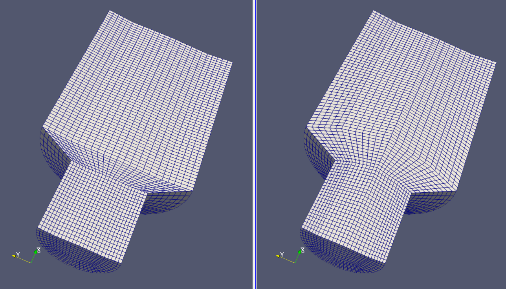

> See `examples/optimization` for the diffuser example.

## Debugging

By default, a `debug.vtk` file is created where each block represents a hexahedral cell.
By showing `block_ids` with a proper color scale the blocking can be visualized.
This is useful when blockMesh fails with errors reporting invalid/inside-out blocks but VTK will
happily show anything.

## Showcase

These are some screenshots of parametric models, built with classy_blocks.

Rectangular ducts (Extrude and Revolve Operations)


3D pipes with twists and turns (chained Elbow and Cylinder Shapes)
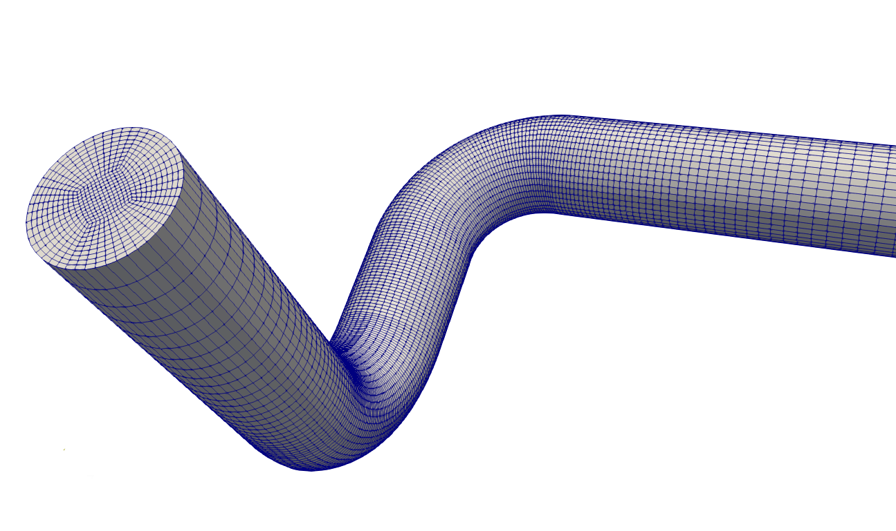

A simple tank with rounded edges
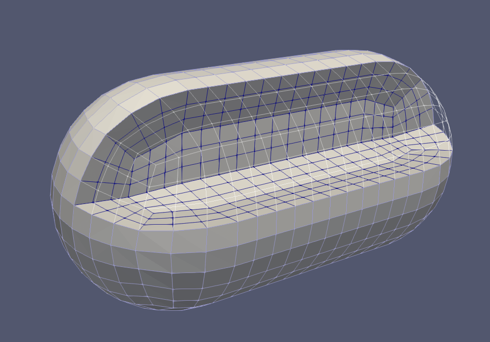

A flywheel in a case. VTK Blocking output for debug is shown in the middle


Venturi tube
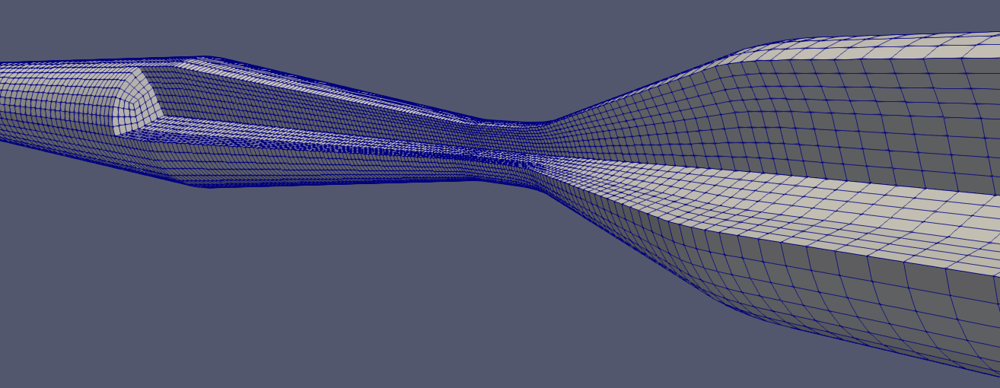

2D mesh for studying Karman Vortex Street
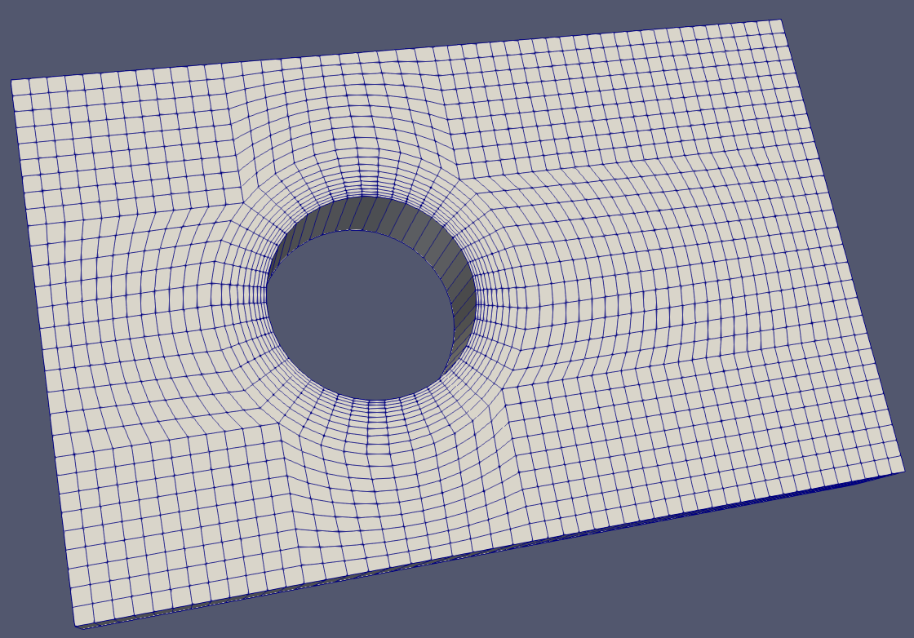

Helmholtz nozzle, a resonator with sharp edges. See [this sketch](https://www.researchgate.net/figure/Schematic-diagram-of-a-Helmholtz-oscillator-and-its-operating-principles_fig6_305275686).
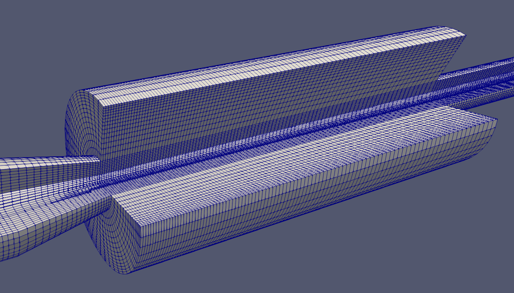

Edges and faces, projected to an STL surface
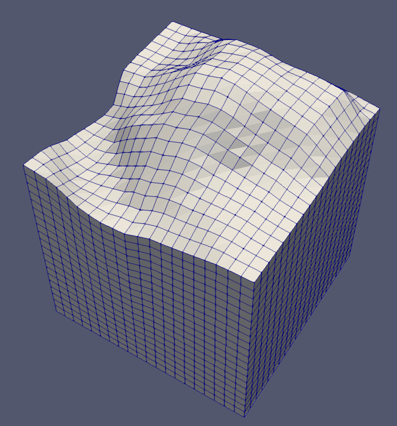

Mesh for studying flow around a sphere, with projected edges and faces
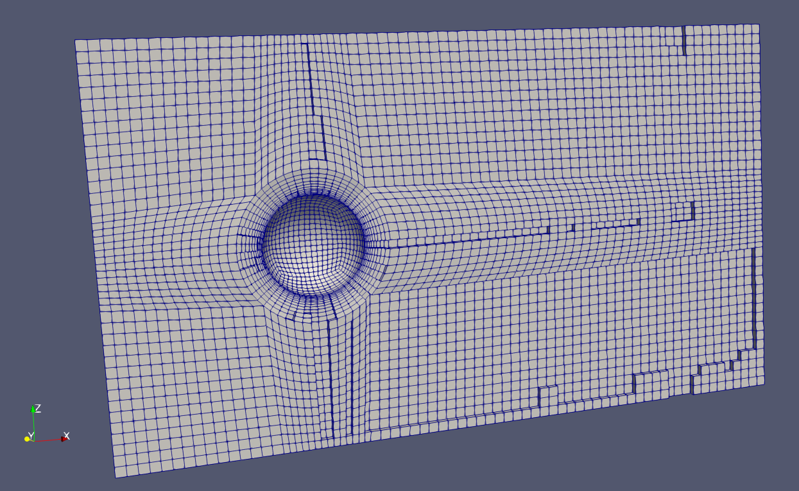

Airfoil core with blunt trailing edge (imported points from NACA generator) and adjustable angle of attack. Exact blocking is determined by in-situ optimization
(see `examples/complex/airfoil.py`). A simulation-ready mesh needs additional blocks to expand domain further away from the airfoil.
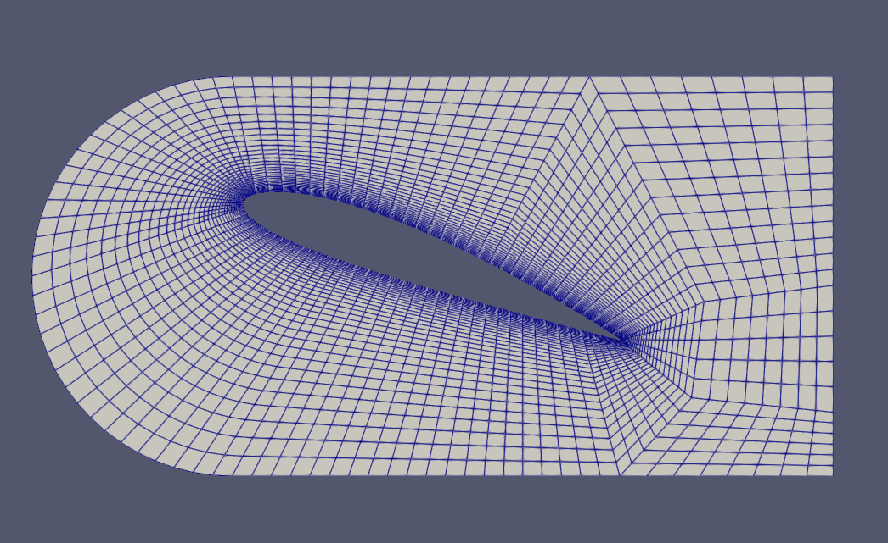

A parametric, Low-Re mesh of a real-life impeller *(not included in examples)*
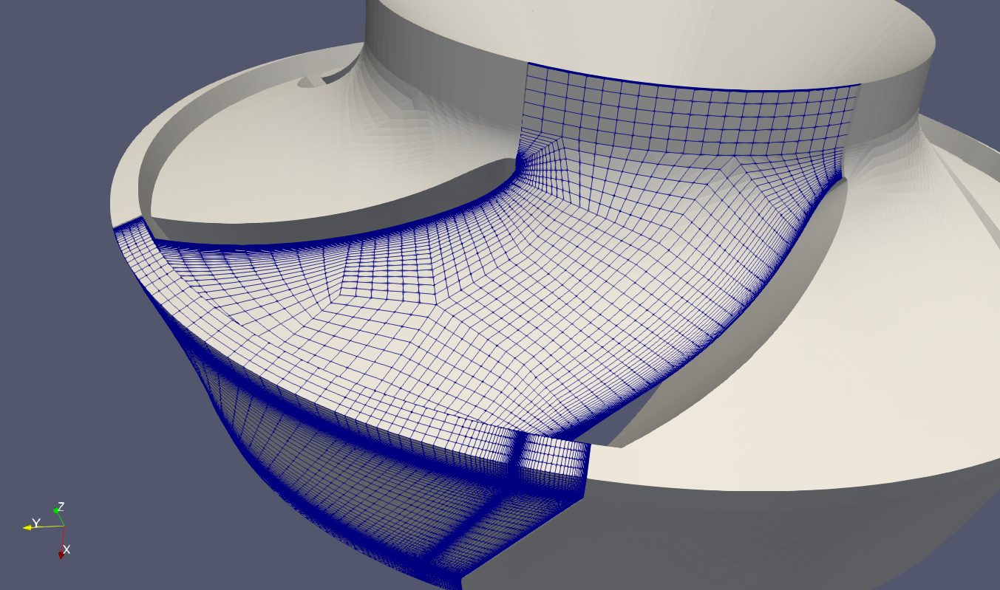

A complex example: parametric, Low-Re mesh of a cyclone
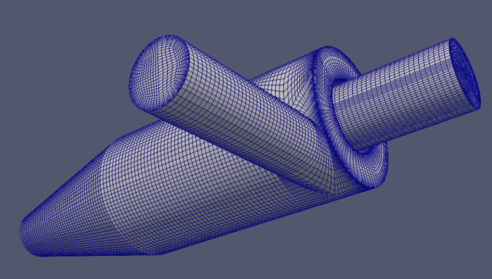

# Prerequisites

Package (python) dependencies can be found in *pyproject.toml* file.
Other dependencies that must be installed:
- python3.8 and higher
- OpenFoam: .org or .com version is supported, foam-extend's blockMesh doesn't support multigrading but is otherwise also compatible.

# Technical Information

There's no official documentation yet so here are some tips for easier navigation through source.

## The Process, Roughly

1. User writes a script that defines operations/shapes/objects, their edges, projections, cell counts, whatever is needed.
1. All the stuff is added to mesh.
1. Mesh converts user entered data into vertices, blocks, edges and whatnot.
1. The mesh can be written at that point; or,
1. Modification of placed geometry, either by manually moving vertices or by utilizing some sort of optimization algorithm.
1. Output of optimized/modified mesh.

# TODO
- Unchecked list items from [Features](#features)
- Usability
    - Frustum with any profile, not just arc
    - Joining two blocks by moving vertices/creating new blocks
- Technical stuff:
    - Skew transform
    - Debugging: connection between block and Shapes, naming
    - 101% test coverage
    - Documentation
